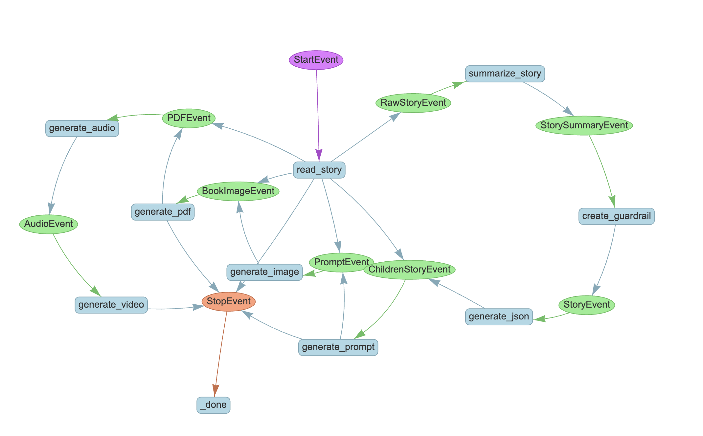

# StoryBook App - Make fun and engaging children's story
StoryBook App takes a text story and creates a fun and engaging picture book in PDF or video format for small children in minutes. 
The concept used in this application can also be used to take any subject material and convert into a simple and fun teaching or self learning book or video for small children by teachers and parents.  

## Requirements

Python 3.9, 3.10 or 3.11.


## Installation

1. Clone the repo and `cd` into the code directory
```bash
➜  git clone https://github.com/sekharkafle/storycreator.git
➜  cd storycreator
```
2. Setup virtual environment (optional):
```bash
python3 -m venv .venv
source .venv/bin/activate
```

3. Install dependencies:
```bash
pip install -r requirements.txt
```

4. Create `.env` file in your code root directory and set NVIDIA API Key:
```bash
NVIDIA_API_KEY=...
```
## Usage

To run the program, use below command:

```
python3 storygen.py --url https://en.wikipedia.org/wiki/The_Sparrow%27s_Lost_Bean
```
After successful execution, the program will generate video output file ./data/video/story_video.mp4 .
To generate the book in pdf format, pass --pdf option in the command.
```
python3 storygen.py --url https://en.wikipedia.org/wiki/The_Sparrow%27s_Lost_Bean --pdf
```
The output file will be at ./data/story.pdf .


## Technology Details
#### LlamaIndex
LamaIndex is used as a framework to build the application. Workflow in LlamaIndex facilitated chaining together various steps needed to generate a story book. Below diagram illustrates workflow steps and corresponding events chained in a sequence.

#### NVIDIA NIM API
NVIDIA hosted NIM API was used to accelerate the development by accessing readily available inference endpoints of GenAI models. NIM API is used in below steps of the workflow:    

<strong>summarize_story</strong> - Creates a summary of the user provided story or the text content. Meta's llama3-70b-instruct model is used for this purpose. Additionally, NVIDIA's NV-Embed-QA model is used for vector embedding generation. 

<strong>create_guardrail</strong> - Ensures content generated is safe for children. Meta's llama3-8b-instruct is used for this purpose.

<strong>generate_json</strong> - Recreates a story in a children book format by returning JSON object with the book title and text content for each page in the book. Meta's llama3-70b-instruct model is used for this purpose.

<strong>generate_prompt</strong> - Generates prompts needed to generate image needed to create title page and inside page of the book. Meta's llama3-70b-instruct model is used for this purpose.

<strong>generate_image</strong> - Generates image needed to create title page and inside page of the book by passing the prompt passed from previous step to the GenAI model. StabilityAI's stable-diffusion-3-medium model is used for this purpose.

#### NeMo Guardrails
As noted earlier, NeMo Guardrails is used in create_guardrail step to control the output generated by LLM to ensure it is safe for small children.

#### Other Tools Used

<strong>ReportLab</strong> - ReportLab library is used to generate PDF by combining the image and text content generated by GenAI models to create a PDF book. This is done in <strong>generate_pdf</strong> step.

<strong>PyMuPDF</strong> - PyMuPDF library is used to export PDF pages to image files. This is done in <strong>generate_video</strong> step.

<strong>gTTS</strong> - gTTS library is used for text to sppech conversion to generate audio for story pages. This is done in <strong>generate_audio</strong> step.

<strong>moviepy.editor</strong> - MoviePy library is used to generate video for story book by combining audio and image generated for each page in the book. This is done in <strong>generate_video</strong> step.

## Limitation
Currently, there is limitation in the quality of image and audio generated. Using a better TTS service will enhance the audio quality. Image quality and relevance can be enhanced by generating better prompts or by using more advanced models. Furthermore, cerating a short dynamic video will further enhance the quality of final video generated. In addition, providing human-in-the-loop feedback in each step has potential to enhance the overall quality of the output.

## TODO 
- Add steps to get Human-in-the-loop feedback to improve model generated image and/or text output.  
- Add debug logs to help troubleshoot issues.
- Generate dynamic video segments rather than using static images.
- Generate better audio using more advanced TTS service. 
